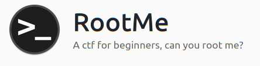
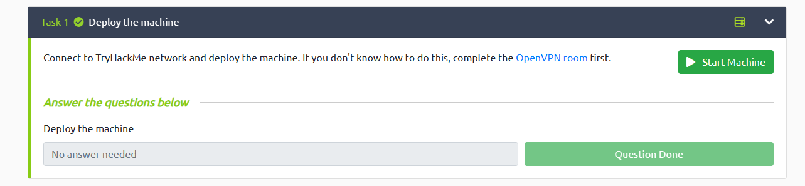
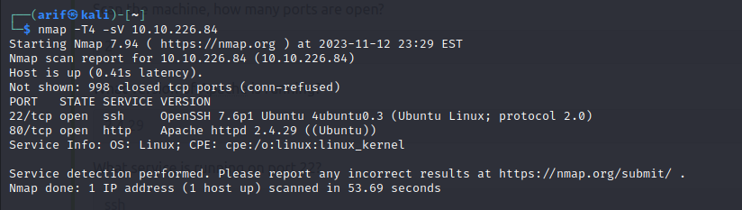
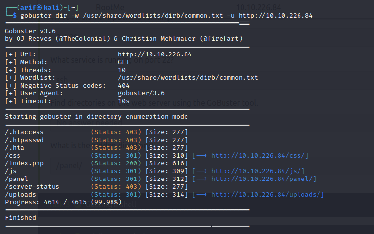
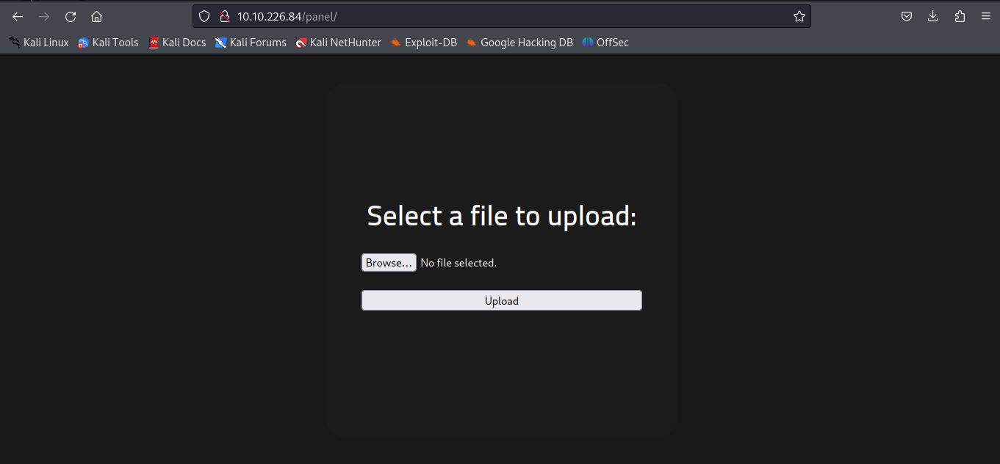
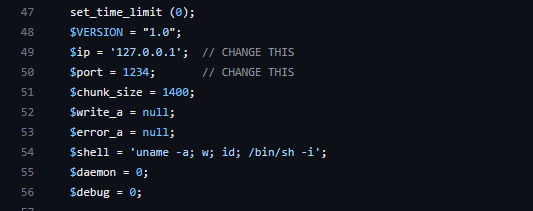
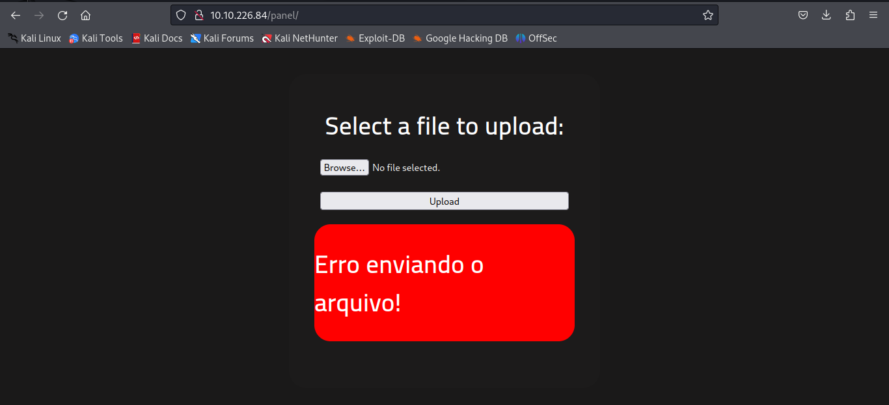
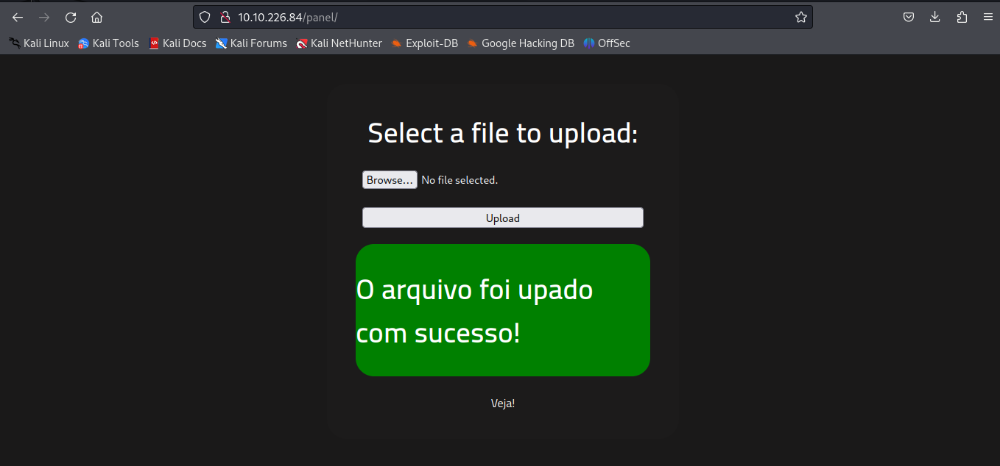
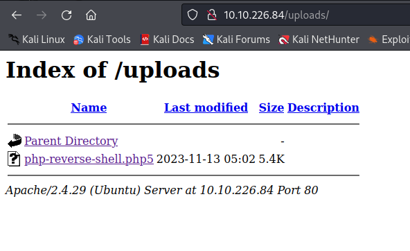
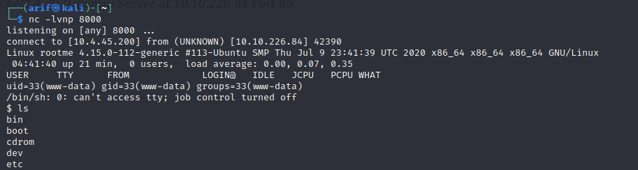

# RootMe

<p align="center">
  
</p>

### Task 1: Deploy the machine

Power up OpenVpn on your machine or use the AttackBox provided by the TryHackMe room. 
<p align="center">
  
</p>

### Task 2: Reconnaissance

Now, we are going to use <b>Nmap</b> for port enumeration and scanning.
```
nmap -T4 -sV {ip_address} 
```
* -T4 is also known as aggressive scan mode and used to scan more quickly
* -sV allows the user to collect version information about the port
* <b>{ip_address}</b> can be found using <b>ifconfig</b> on Linux Terminal
<p align="center">
  
</p>
From this Nmap scan, we can answer several questions

<b>2.1 Scan the machine, how many ports are open? </b>
* 2
  
<b>2.2 What version of Apache is running? </b>
* 2.4.49
  
<b>2.3 What service is running on port 22? </b>
* ssh

Next, we need to use <b>Gobuster</b> tool to find the hidden directories. 
```
gobuster dir -w {wordlist_path} -u http://{ip_address}
```
* <b>{wordlist_path}</b> can be found in Kali Linux directory, (usr/share/wordlists). There are many common-used wordlists such as common.txt, rockyou.txt and more. You can also search for wordlist text files online.

<p align="center">
  
</p>

There are several hidden directories that are interesting to check out which are /panel and /uploads

<b>2.4 What is the hidden directory? </b>
* /panel

### Task 3: Getting a shell

We'll check the /panel directory first.
<p align="center">
  
</p>

The /panel directory requires us to upload a file. The question has given us some hints about where we need to upload PHP reverse shell to the web. You can download the PHP reverse shell from the <a href="https://github.com/pentestmonkey/php-reverse-shell" target="_blank">PentestMonkey</a> Github repository.

<p align="center">
  
</p>

After downloading the reverse shell, we need to change the IP address according to your machine and the port number to any number that you want (make sure that the port number had not been used by other services). 

<p align="center">
  
</p>

Looks like it gives us an error when we want to upload the file. So, we can try to change the extension of the file from .php to other PHP extensions (.phtml, .php3, .php4, .php5). I try to change the extension into .php5 and it works. 

<p align="center">
  
</p>

After you have successfully uploaded the reverse shell, we can start Netcat listener in our terminal. Make sure to use the same port number that you choose in the reverse shell.
```
nc -lvnp {port_no}
```

Now you have Netcat listening to the port number, and you need to find a way to execute the reverse shell that you had uploaded. Remember /uploads directory we get from the Gobuster tool? This is where we need to access that directory.
<p align="center">
  
</p>

Click on the reverse shell that you uploaded. Then, go to the Netcat listener and you will have a shell running in Netcat terminal. 

<p align="center">
  
</p>

In order to find user.txt, you can use this command: 

```
find -name user.txt
```
It will shows you the path and you can read the file using ```cat```

3.1 user.txt
* THM{***************"}

